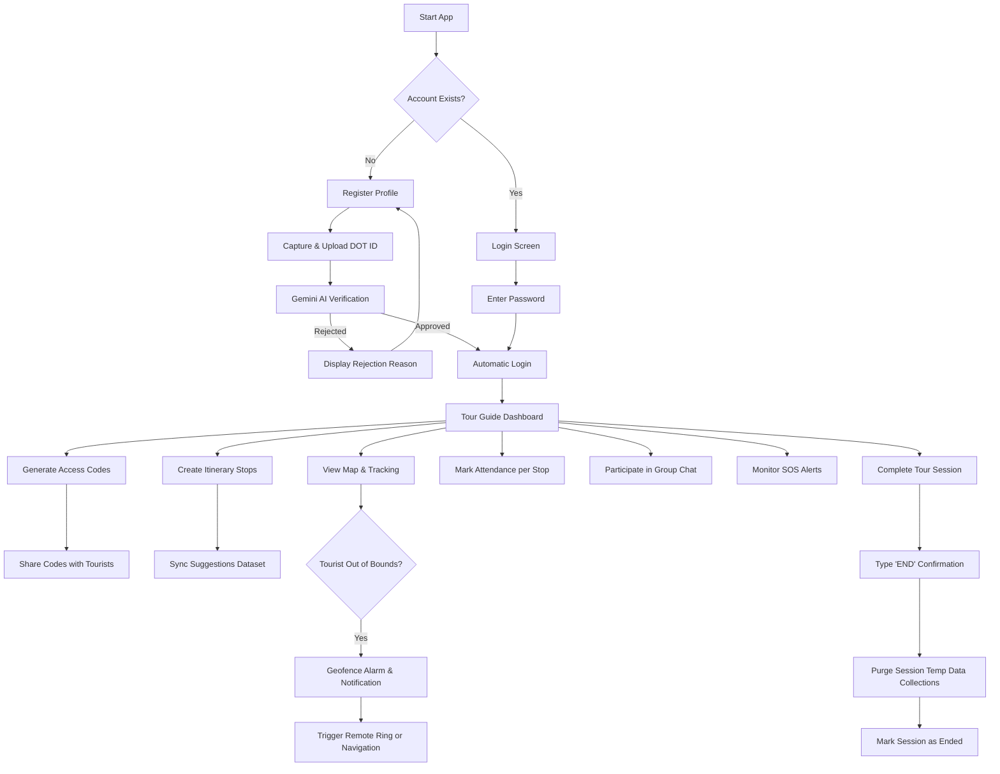
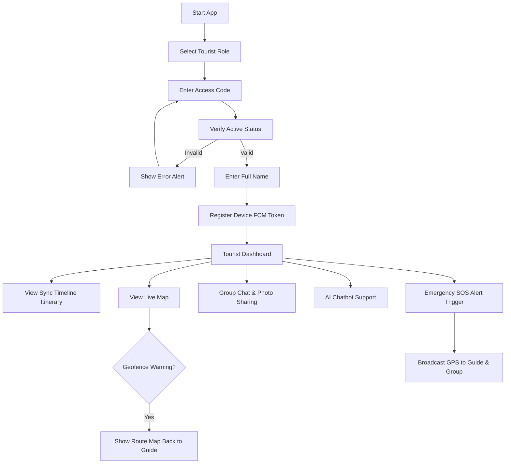
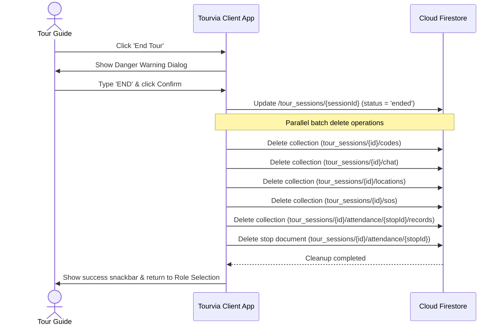

# TOURVIA: Comprehensive System Module Scope & Feature Documentation

This document provides a detailed, comprehensive specification of all functional modules, user roles, workflows, database schemas, and external integrations implemented in the **TOURVIA** application.

---

## 1. Document Overview

This specification maps the exact capabilities, boundaries, and internal workflows of every software module in **TOURVIA**. It outlines how the system operates in a real-world scenario, covering the technical mechanics and user journeys from registration to the conclusion of a tour.

---

## 2. Platform & Architecture Specifications

The TOURVIA application is built on a modern, cross-platform technical stack utilizing standard serverless infrastructure:

| Component | Technology | Role in System |
|---|---|---|
| **Frontend Framework** | Flutter (Dart SDK ^3.9.0) | Cross-platform mobile client for Android, iOS, and Web. |
| **Backend services** | Firebase BaaS | Authentication, real-time database, storage, and push notifications. |
| **Primary Database** | Cloud Firestore (NoSQL) | Real-time synchronized collections and sub-collections. |
| **Object Storage** | Firebase Storage | Hosting of user photos, uploaded DOT ID cards, and group chat media. |
| **Notification Engine** | Firebase Cloud Messaging (FCM) | Server-to-client push notification broadcasts for SOS alerts. |
| **AI Vision Model** | Google Gemini Vision API (`gemini-1.5-flash`) | Automated verification of Department of Tourism (DOT) ID cards. |
| **AI NLP Model** | OpenAI API (`gpt-4o-mini`) | Context-restricted Philippine tourism assistant. |
| **Map Rendering** | OpenStreetMap (OSM) Tiles | Interactive base mapping via `flutter_map`. |

---

## 3. User Roles and Authorization Matrix

The application handles permissions dynamically through user role checks (`users/{uid}/role`) and access code associations:

| System Capability | Tour Guide | Tourist | Unauthenticated / Guest |
|---|:---:|:---:|:---:|
| Register Tour Guide Account | ❌ | ❌ | ✅ |
| Scan/Verify DOT ID via Gemini AI | ❌ | ❌ | ✅ |
| Log In with Email & Password | ✅ | ❌ | ❌ |
| Log In with Tour Access Code | ❌ | ✅ | ✅ |
| Recover Password via Email Link | ✅ | ❌ | ❌ |
| View/Edit Core Profile & Photo | ✅ | ❌ | ❌ |
| Reset Password (Re-authentication) | ✅ | ❌ | ❌ |
| Generate & Invalidate Access Codes | ✅ | ❌ | ❌ |
| Edit, Reorder, & Delete Itinerary Stops | ✅ | ❌ | ❌ |
| View Itinerary Stops & Forecast | ✅ | ✅ (Read-Only) | ❌ |
| Mark/Monitor Destination Stop Attendance | ✅ | ❌ | ❌ |
| View Live Locations on Map | ✅ (All Tourists) | ✅ (Self & Guide) | ❌ |
| Trigger Remote Device Ringing | ✅ | ❌ | ❌ |
| Broadcast/Receive Boundary Warnings | ✅ | ✅ | ❌ |
| Trigger Emergency SOS Alerts | ✅ | ✅ | ❌ |
| Post Messages & Media in Group Chat | ✅ | ✅ | ❌ |
| Ask Questions to AI Assistant | ✅ | ✅ | ❌ |
| Officially End Tour Session | ✅ | ❌ | ❌ |

---

## 4. Module-by-Module Functional Scope

### 4.1 Authentication Module

This module governs app access, splitting entry workflows by user role: Tour Guides authenticate via encrypted credentials, while Tourists log in using a session-bound access code.

#### Features & Capabilities
*   **Role Selection Panel:** A clean, animated landing page that routes users to either "Tour Guide" credentials entry or "Tourist" code entry.
*   **Guide Credentials Login:** Secure authentication using email and password via Firebase Auth.
*   **Guide Status Validation:** Post-authentication hook checks the Firestore profile status (`users/{uid}/status`):
    *   `approved`: User gains access to the Guide Dashboard.
    *   `pending`: User is signed out immediately and shown: *"Your account is pending approval. Please wait for admin confirmation."*
    *   `rejected`: User is signed out immediately and shown the specific rejection reason.
*   **Tourist Code Login:** Verifies code input (e.g., `TRV-XXXXXX`) against the `tour_sessions/{sessionId}/codes` collectionGroup index. If the code is active and exists:
    *   Prompts the tourist to enter their name.
    *   Registers their device FCM token in the session sub-collection.
    *   Maps the tourist’s app instance to that specific active tour session.
*   **Forgot Password Flow:** Sends a password reset email link via Firebase Auth.

#### Complete User Workflow
```
[User Launch App] 
       │
       ├──► [Select "Tour Guide"] ──► [Enter Credentials] ──► [Validate Firestore Status] ──► [Go to Guide Dashboard]
       │                                                                  │
       │                                                                  └──► (Pending/Rejected -> Show Alert Dialog)
       │
       └──► [Select "Tourist"] ──► [Enter Access Code] ──► [Verify Firestore Group Index] ──► [Enter Name] ──► [Go to Tourist Dashboard]
```

---

### 4.2 Registration Module (AI-Powered DOT ID Verification)

This module handles Tour Guide onboarding. It uses the Google Gemini Vision API to parse, validate, and verify uploaded accreditation ID photos, preventing unauthorized users from accessing the app.

#### Features & Capabilities
*   **Comprehensive Registration Form:** Input fields for Full Name, Age (must be 18+), Email Address, Contact Number, Tour Guide ID Number, and Password.
*   **Image Acquisition Engine:** Directly interfaces with the device camera or gallery using `image_picker` with compressed resolution limits to optimize API transmission.
*   **Gemini Vision Validation Pipeline:** Sends the image bytes and mimetype to the `gemini-1.5-flash` model alongside a highly restricted system prompt.
*   **Multi-Point AI Compliance Checking:**
    1.  *Official Logo Detection:* Checks for the Philippine Department of Tourism logo and associated headers.
    2.  *Layout Authenticity:* Validates that card elements match official DOT ID formats.
    3.  *OCR Extraction:* Parses Name, ID Number, Accreditation Type, and Expiry Date.
    4.  *Expiry Validation:* Checks if the extracted date is valid and unexpired.
    5.  *Image Quality Assurance:* Validates clarity (not cropped, blurry, or under-exposed).
*   **Registration Outcome States:**
    *   *Passed:* Automatically uploads the ID image to Firebase Storage, registers the user in Firebase Auth, creates the Firestore document with `status: "approved"`, logs the guide in, and opens the Guide Dashboard.
    *   *Failed:* Prevents account creation, flags the session, and presents the guide with the exact rejection reason returned by the AI (e.g., *"Rejection Reason: The uploaded ID card has expired as of 2025-12-31"*).

#### Technical Specifications & AI Prompts
*   **Model:** `gemini-1.5-flash` via HTTP REST endpoint.
*   **Temperature:** `0.1` for consistent deterministic extraction.
*   **JSON Response Schema:**
    ```json
    {
      "isOfficialDotId": true,
      "extractedName": "JUAN P. DELA CRUZ",
      "extractedIdNumber": "DOT-NCR-TG-00123",
      "accreditationType": "REGIONAL",
      "expiryDate": "2027-06-30",
      "isExpired": false,
      "isImageClear": true,
      "failureReason": null
    }
    ```

#### Complete User Workflow
```
[Click Register] 
       │
       ▼
[Enter Profile Details] 
       │
       ▼
[Capture DOT ID Photo] ──► [Call Gemini Vision API]
                                   │
         ┌─────────────────────────┴─────────────────────────┐
         ▼                                                   ▼
[AI Check Fails]                                     [AI Check Passes]
         │                                                   │
         ▼                                                   ▼
[Show Rejection Reason]                             [Upload Photo to Cloud Storage]
[Stay on Registration]                                       │
                                                             ▼
                                                    [Create Auth & Profile]
                                                    [Redirect to Guide Dashboard]
```

---

### 4.3 Dashboard Module

The dashboard acts as the central hub of the application, dynamically displaying active tour details and providing quick access to all system modules.

#### Features & Capabilities
*   **Guide Home Screen (`TourGuideHomeScreen`):**
    *   *Welcome Header:* Dynamic display of the guide's name and their profile avatar.
    *   *Active Tour Banner:* Real-time metadata displaying the current tour name, active/ended status, current day indicator (e.g., *"Day 2 of 5"*), and active tourist count.
    *   *System Status Banners:* Prominent indicators for active SOS alerts and geofence breaches.
    *   *End Tour Action:* Access to the tour teardown workflow.
    *   *Grid Navigation:* Quick access to Itinerary, Attendance, Tracking, Messages, Weather, SOS Log, AI Assistant, and Access Code screens.
*   **Tourist Home Screen (`TouristHomeScreen`):**
    *   *Traveler Header:* Greets the tourist by their self-registered name.
    *   *Active Tour Card:* Displays the tour name, active day, current participants count, and the assigned Guide's name.
    *   *Grid Navigation:* Quick access to Tracking Map, Group Chat, Weather Forecast, SOS/Help, and AI Assistant.

---

### 4.4 Tour Guide Management Module

This module allows Tour Guides to manage their profile credentials, security settings, and contact information.

#### Features & Capabilities
*   **Read-Only Metrics:** Displays the Guide's official Tour Guide ID number and AI accreditation status, which cannot be modified after registration.
*   **Editable Profile Fields:** Allows updates to Full Name, Contact Number, Email Address, and Home Address.
*   **Profile Image Upload:** Integrates with camera and gallery sources, uploading images to `users/{uid}/profilePhotoUrl` in Firebase Storage.
*   **Security Settings:** Re-authenticates the guide with their current password before allowing them to update to a new password.

---

### 4.5 Tourist Management Module

This module provides the Tour Guide with tools to manage participants, monitor locations in real-time, and ensure tourist safety.

#### Features & Capabilities
*   **Active Roster view:** Displays a list of all tourists who have joined the active session, showing their assigned access codes.
*   **Live OpenStreetMap tracking:** Plots the real-time locations of both the guide and all tourists on an interactive map.
*   **1 Kilometer Geofencing:** Renders a 1 km circular boundary centered on the guide's coordinates.
*   **Out-of-Bounds Detection:** Automatically marks tourists outside the 1 km boundary with a warning icon, shifts their status to "Outside boundary", and displays an alert banner on the guide's map.
*   **Last-Seen Tracker:** Displays coordinates, distance, and elapsed time since the last location update for missing tourists.
*   **Navigation Shortcuts:** Launches walking directions from the guide's current coordinates to the missing tourist's location in Google Maps.
*   **Remote Ringing Trigger:** Sends a flag to the tourist's document (`locations/{touristId}/ringCommand: true`), triggering a continuous vibration and alarm on their device to get their attention.
*   **Ring All Feature:** Sends the ring command to all tourists in the session simultaneously.

---

### 4.6 Itinerary Module

This module handles stop scheduling, route organization, and destination recommendations for the tour.

#### Features & Capabilities
*   **Interactive Timeline:** Displays tour stops in chronological order with custom visual indicators.
*   **Stop Configuration:** Guide can add, edit, or remove stops, defining the Destination Name, Date, Start Time, End Time, and optional notes.
*   **Curated Suggestions Engine:** Provides searchable destination suggestions from a pre-defined dataset of popular Philippine tourist spots when typing a location.
*   **Drag-and-Drop Reordering:** Features a `ReorderableListView` that allows the guide to change stop orders and saves the new sequence directly to Firestore.
*   **Weather Forecast Integration:** Displays current temperature, general weather conditions, and precipitation probability at the top of the Itinerary screen based on coordinates.
*   **Live Tourist Sync:** Instantly syncs itinerary changes to tourists' screens via real-time Firestore listeners.
*   **Read-Only Tourist Timeline:** Displays the timeline to tourists, showing their personal attendance status for each stop (e.g., "Present", "Absent", "Pending").

---

### 4.7 Generate Access Code Module

This module controls the generation and distribution of the access codes required for tourists to join a tour.

#### Features & Capabilities
*   **Randomized Code Generation:** Generates unique, secure codes matching the `TRV-XXXXXX` format.
*   **Batch Creation Engine:** Allows guides to generate up to 50 codes at once using a batch write for atomic Firestore updates.
*   **Access Code Ledger:** Lists all codes generated for the active session, showing status (Unassigned/Waiting vs. Joined/Claimed) and joined tourist names.
*   **Slot Reset Function:** Allows the guide to clear a tourist's name from a code, resetting the slot so a new tourist can use the code.
*   **Selective Invalidation:** Allows the guide to delete individual codes, which immediately blocks access for any tourist using that code.
*   **Clipboard Integration:** Quick-copy button copy codes directly to the device clipboard for easy sharing.

---

### 4.8 Tour Management Module (Start / End Tour)

This module handles the lifecycle of a tour session, managing the setup and cleanup of session data.

#### Features & Capabilities
*   **Session Initialization:** Automatically creates the tour session in Firestore, setting the default title, duration, status, and linking the guide's credentials.
*   **Dynamic Day Updates:** Allows guides to update the current tour day (e.g., Day 1 to Day 2) to keep tourists aligned.
*   **End Tour Teardown Workflow:**
    1.  *Warning Dialog:* Prompts the guide with a summary of the cleanup actions before ending the tour.
    2.  *Confirmation Validation:* Requires the guide to type "END" to prevent accidental triggers.
    3.  *Data Purge:* Executes Firestore batch deletes to clear temporary session data:
        *   `codes` (invalidates access codes)
        *   `chat` (deletes group chat history)
        *   `locations` (deletes live GPS tracking data)
        *   `sos` (removes active alerts)
        *   `attendance` records (clears stop attendance logs)
    4.  *Historical Archiving:* Marks the main session status as `ended` and preserves the itinerary timeline for historical records.

---

### 4.9 Settings & Profile Module

This module provides access to application information, developer credits, reference links, and legal terms.

#### Features & Capabilities
*   **Unified Settings Panel:** A simple list menu tailored to the user's role.
*   **About the App screen:** Outlines the core mission of TOURVIA.
*   **About the Developers screen:** Displays the academic research group details and project timeline.
*   **References screen:** Lists the APIs, libraries, and resources used in the application.
*   **Terms and Conditions screen:** Outlines user responsibilities and the privacy policy, particularly regarding GPS location tracking.
*   **Safe Log Out:** Logs the user out of the session or Firebase Auth after confirmation.

---

### 4.10 Reports Module

This module processes session data to generate summaries of tour activities.

#### Features & Capabilities
*   **Stop-by-Stop Attendance Metrics:** Displays present, absent, and pending counts for each stop, helping guides track group movements.
*   **Roster Summary:** Shows the total number of joined participants and active codes in the session.
*   **Historical SOS Logs:** Lists all triggered SOS alerts in the session, including sender names, coordinates, and resolution timestamps.

---

### 4.11 Notifications Module (FCM Integration)

This module manages push notifications for critical, time-sensitive updates, such as SOS alerts and geofence breaches.

#### Features & Capabilities
*   **FCM Token Management:** Requests system notification permissions and saves device tokens to `users/{uid}` (guides) or `tourists/{codeDocId}` (tourists).
*   **Foreground In-App Banners:** Shows an in-app banner Snackbar when a notification arrives while the app is open.
*   **Actionable Notification Banners:** Snackbars include a "View" button that routes the user directly to the relevant screen (e.g., opening the SOS screen on alert).
*   **Background/Terminated Taps:** Uses a global navigator key to route users directly to the alert source when they tap a notification from the system tray.

---

### 4.12 AI Verification Module

This module handles the configuration and execution of the AI services integrated into TOURVIA.

#### Features & Capabilities
*   **Gemini Vision Service (`GeminiVisionService`):**
    *   Formats the system prompt instructing the model to verify DOT guide cards.
    *   Structures parameters to require a clean, parseable JSON response.
    *   Handles network timeouts and invalid inputs gracefully.
*   **NLP Tourist Assistant (`ChatbotService`):**
    *   Uses OpenAI's `gpt-4o-mini` to power the chatbot assistant.
    *   Applies system prompts that restrict responses to Philippine tourism topics.
    *   Blocks off-topic queries with a standard response: *"I can only help you with questions about Philippine tourist destinations."*
    *   Features quick-prompt chips for popular destinations (Intramuros, Baguio, Boracay, Palawan) to streamline search inputs.

---

## 5. Database Scope

### 5.1 NoSQL Firestore Collection Structure

```
├── users/ (Collection)
│   └── {uid}/ (Document)
│       ├── fullName (String)
│       ├── age (Number)
│       ├── email (String)
│       ├── contactNumber (String)
│       ├── tourGuideId (String)
│       ├── status (String: pending | approved | rejected)
│       ├── role (String: tour_guide)
│       ├── profilePhotoUrl (String?)
│       ├── address (String?)
│       ├── idPhotoUrl (String?)
│       ├── fcmToken (String?)
│       ├── platform (String?)
│       ├── createdAt (Timestamp)
│       └── updatedAt (Timestamp?)
│
├── tour_sessions/ (Collection)
│   └── {sessionId}/ (Document)
│       ├── tourName (String)
│       ├── totalDays (Number)
│       ├── currentDay (Number)
│       ├── status (String: active | ended)
│       ├── guideId (String?)
│       ├── guideName (String?)
│       ├── createdAt (Timestamp)
│       ├── endedAt (Timestamp?)
│       │
│       ├── codes/ (Sub-collection)
│       │   └── {codeDocId}/ (Document)
│       │       ├── code (String)
│       │       ├── isActive (Boolean)
│       │       ├── touristName (String?)
│       │       ├── claimedAt (Timestamp?)
│       │       ├── sessionId (String)
│       │       └── createdAt (Timestamp)
│       │
│       ├── tourists/ (Sub-collection)
│       │   └── {codeDocId}/ (Document)
│       │       ├── fcmToken (String)
│       │       ├── platform (String)
│       │       └── tokenUpdatedAt (Timestamp)
│       │
│       ├── itinerary/ (Sub-collection)
│       │   └── {stopId}/ (Document)
│       │       ├── destinationName (String)
│       │       ├── date (String)
│       │       ├── startTime (String)
│       │       ├── endTime (String)
│       │       ├── notes (String)
│       │       ├── order (Number)
│       │       └── updatedAt (Timestamp)
│       │
│       ├── attendance/ (Sub-collection)
│       │   └── {stopId}/ (Document)
│       │       └── records/ (Sub-collection)
│       │           └── {touristUid}/ (Document)
│       │               ├── touristId (String)
│       │               ├── touristName (String)
│       │               ├── touristCode (String)
│       │               ├── status (String: present | absent | pending)
│       │               ├── checkInTime (Timestamp?)
│       │               ├── stopId (String)
│       │               ├── sessionId (String)
│       │               └── updatedAt (Timestamp)
│       │
│       ├── chat/ (Sub-collection)
│       │   └── {messageId}/ (Document)
│       │       ├── text (String)
│       │       ├── senderId (String)
│       │       ├── senderName (String)
│       │       ├── isGuide (Boolean)
│       │       ├── isMedia (Boolean)
│       │       ├── mediaUrl (String?)
│       │       └── timestamp (Timestamp)
│       │
│       ├── locations/ (Sub-collection)
│       │   └── {userId}/ (Document)
│       │       ├── userId (String)
│       │       ├── userName (String)
│       │       ├── latitude (Double)
│       │       ├── longitude (Double)
│       │       ├── accuracy (Double)
│       │       ├── isGuide (Boolean)
│       │       ├── ringCommand (Boolean)
│       │       └── updatedAt (Timestamp)
│       │
│       └── sos/ (Sub-collection)
│           └── {alertId}/ (Document)
│               ├── id (String)
│               ├── senderId (String)
│               ├── senderName (String)
│               ├── lat (Double)
│               ├── lng (Double)
│               ├── timestamp (Timestamp)
│               ├── isResolved (Boolean)
│               └── resolvedAt (Timestamp?)
```

### 5.2 Data Lifecycle & Retention Policies

To optimize database storage and protect user privacy, TOURVIA divides collections into permanent directories and temporary session folders.

| Data Collection | Creation Trigger | Retention Period | Deletion Cleanup Mechanism |
|---|---|---|---|
| **`users`** | Guide registers on app. | Permanent. | Not deleted (system record). |
| **`tour_sessions`** | Guide initializes a session. | Permanent. | Not deleted (session metadata history). |
| **`tour_sessions/itinerary`** | Guide adds stops. | Permanent. | Preserved for history records. |
| **`tour_sessions/codes`** | Guide generates access codes. | Session-bound. | Purged on "End Tour" trigger. |
| **`tour_sessions/chat`** | User posts message/photo. | Session-bound. | Purged on "End Tour" trigger. |
| **`tour_sessions/locations`** | Periodic GPS coordinates update. | Session-bound. | Purged on "End Tour" trigger. |
| **`tour_sessions/sos`** | User triggers SOS. | Session-bound. | Purged on "End Tour" trigger. |
| **`tour_sessions/attendance`** | Guide records attendance. | Session-bound. | Purged on "End Tour" trigger. |

---

## 6. End-to-End User Workflows

### 6.1 Tour Guide Workflow



### 6.2 Tourist Workflow



### 6.3 Dynamic End Tour Cleanup Workflow



---

## 7. Assumptions & System Boundaries

To function properly, the application depends on several external systems and conditions:

1.  **Continuous Internet Access:** TOURVIA requires an active internet connection (cellular data or Wi-Fi) to sync real-time features like GPS tracking, group chat, AI chatbot responses, and push notifications.
2.  **GPS Hardware Dependency:** Devices must have functional GPS hardware and system location services enabled.
3.  **Third-Party API Uptime:** The app depends on the availability of the Google Gemini API, OpenAI API, and OpenStreetMap tile servers.
4.  **Accreditation ID Quality:** The accuracy of the automated ID verification depends on the user uploading clear, well-lit photos of authentic DOT ID cards.
5.  **Single Active Session:** The system assumes a guide manages only one active tour session at a time, using a single session identifier.

---

> **Document Version:** 1.1  
> **Last Updated:** July 2026  
> **Target Application:** TOURVIA Mobile App (Philippines)
