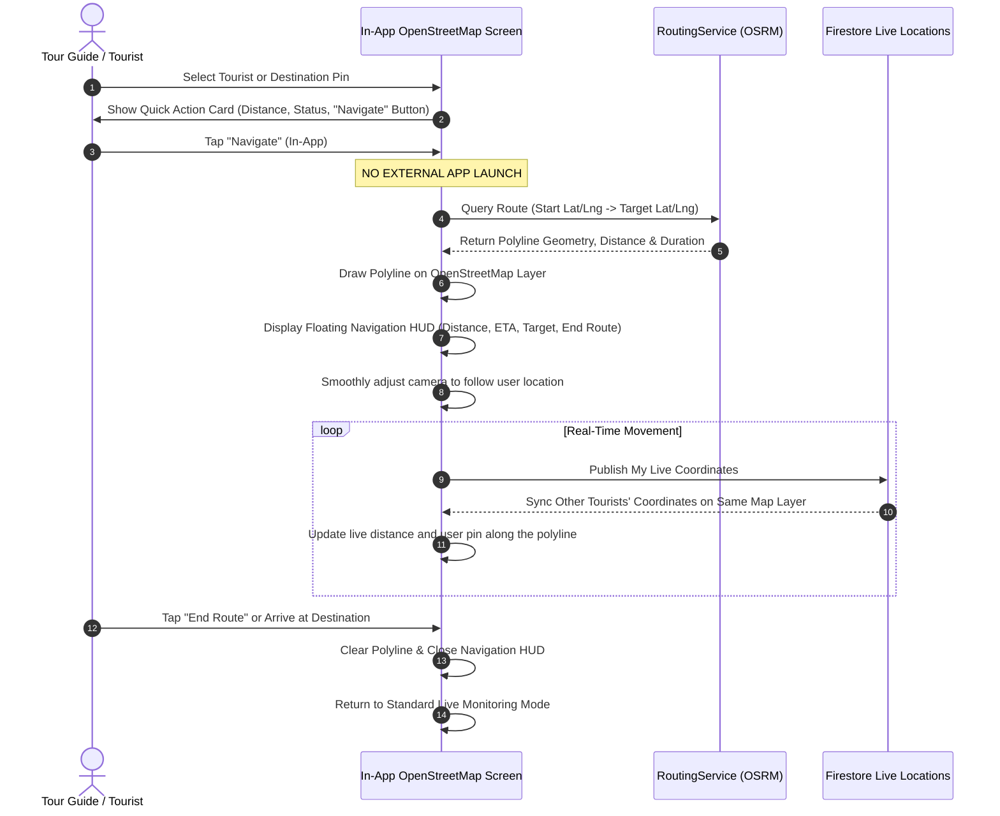

# Tourvia — System Revision 03: In-App Navigation and Live Tracking

> **Revision Code:** `REV-003`  
> **Module:** Live Tracking, Geofencing, and In-App Map Navigation  
> **Date:** September 13, 2026  
> **Status:** Specification Ready / Awaiting Implementation  
> **Target Platforms:** Android, iOS, Web  

---

## 1. Overview & Problem Statement

### 1.1 Problem Statement
In previous iterations, tapping **"Navigate"** or **"Get Directions"** to a tourist or destination triggered an external application launch via `launchUrl`:
```dart
// Previous external redirection logic:
final mapsUri = Uri.parse('https://www.google.com/maps/dir/?api=1...');
await launchUrl(mapsUri, mode: LaunchMode.externalApplication);
```
Redirecting the user to the external Google Maps application causes significant operational drawbacks:
1. **Loss of Application Context:** The user is exited out of Tourvia.
2. **Severed Real-Time Visibility:** The Tour Guide can no longer see all tourists' live positions, distances, and status indicators while viewing external Google Maps.
3. **Hidden Safety Features:** Geofence boundary alerts, tourist distance warnings, and SOS emergency banners are hidden when the user is in an external app.
4. **Disrupted Location Synchronization:** Backgrounding the application can lead to throttled GPS updates on mobile operating systems (Android/iOS battery saving).

### 1.2 Revision Objective
**Strictly eliminate all external Google Maps redirections.** Keep all route calculations, turn directions, polyline drawing, and navigation **100% inside Tourvia** using the application's built-in **OpenStreetMap (OSM)** map engine (`flutter_map`) and Open Source Routing Machine (`RoutingService` / OSRM).

---

## 2. In-App Navigation Functional Requirements

### 2.1 Complete Removal of External App Launchers
- Remove all `launchUrl(geoUri)` and `launchUrl(mapsUri)` calls in:
  - [TourGuideMapScreen](file:///c:/flutter_project/TOURVIA/lib/features/tracking/screens/tour_guide_map_screen.dart)
  - [TouristMapScreen](file:///c:/flutter_project/TOURVIA/lib/features/tracking/screens/tourist_map_screen.dart)
- Under no circumstance should tapping a navigation, directions, or route button exit the application.

---

### 2.2 In-App Route Calculation & Polyline Rendering (OpenStreetMap)
- When a Tour Guide or Tourist taps **"Navigate"** (e.g. to locate a tourist, meet the guide, or travel to an itinerary destination):
  1. **OSRM Route Fetch:** The app invokes [RoutingService.getRoute()](file:///c:/flutter_project/TOURVIA/lib/core/services/routing_service.dart) passing the current user's GPS coordinates and the target's coordinates.
  2. **Polyline Layer Drawing:** Decodes the route geometry and renders a dynamic, clearly visible polyline on top of the OpenStreetMap tile layer (`PolylineLayer`).
     - **Active Route Color:** Primary brand blue (`#2196F3` or `#0D47A1`) with 5px stroke width.
     - **Origin & Destination Pins:** Shows custom pulsing marker at start and finish points.
  3. **Auto-Framing Camera:** Smoothly animates the map camera (`_mapController.fitCamera`) to frame both the user's location and the target destination within comfortable padding.

---

### 2.3 Floating In-App Navigation HUD (Heads-Up Display)
When in active navigation mode, display an on-screen floating Navigation Card directly over the map:
- **Target Label:** Name of the target (e.g., *"Heading to: Juan dela Cruz"* or *"Destination: Mayon Viewpoint"*).
- **Live Distance Remaining:** Formatted real-time distance (e.g., `180 m` or `2.4 km`).
- **Estimated Travel Duration (ETA):** Approximate duration based on mode (e.g., `~3 mins walk` or `~8 mins drive`).
- **Travel Mode Toggle:** Quick icon toggle between Walking (`foot`) and Driving (`car`).
- **Recenter Button:** Instant one-tap button to re-center the map camera onto the user's current GPS position.
- **Exit / Cancel Navigation Button:** One-tap **"End Route"** button that clears the active polyline and returns the map to standard monitoring mode.

---

### 2.4 Uninterrupted Real-Time Location Synchronization
Keeping navigation strictly in-app guarantees that:
1. **Live GPS Publishing Remains Active:** The foreground position stream (`Geolocator.getPositionStream`) continues publishing coordinates to Firestore (`/tours/{tourId}/locations/{userId}`) without OS background throttling.
2. **Multi-Tourist Tracking Stays Visible:** While the Tour Guide is navigating toward Tourist A, all other tourists (Tourist B, C, D) remain visible as live pins on the OpenStreetMap in real-time.
3. **Active Geofence Boundary Monitoring:** The safe-zone radius circle (`CircleLayer`) remains rendered on screen; if another tourist breaches the geofence perimeter, the guide receives immediate visual and audio warnings without leaving their navigation screen.
4. **Urgent SOS Alerts:** If any tourist triggers an SOS emergency, the flashing SOS emergency banner displays immediately on the map without being missed in an external app.

---

## 3. User Flow Diagrams

### 3.1 In-App Navigation & Tracking Flow


---

## 4. Technical Architecture & File Changes

| Component | Target File | Nature of Change |
| :--- | :--- | :--- |
| **Guide Live Map** | [lib/features/tracking/screens/tour_guide_map_screen.dart](file:///c:/flutter_project/TOURVIA/lib/features/tracking/screens/tour_guide_map_screen.dart) | Replace `launchUrl` with in-app `PolylineLayer`, active navigation HUD card, and camera following. |
| **Tourist Live Map** | [lib/features/tracking/screens/tourist_map_screen.dart](file:///c:/flutter_project/TOURVIA/lib/features/tracking/screens/tourist_map_screen.dart) | Replace `launchUrl` with in-app routing to Tour Guide using OSRM polyline and HUD. |
| **Routing Service** | [lib/core/services/routing_service.dart](file:///c:/flutter_project/TOURVIA/lib/core/services/routing_service.dart) | Ensure HTTPS/fallback support, polyline decoding to `List<LatLng>`, and walking/driving route optimization. |
| **Location Service** | [lib/core/services/location_service.dart](file:///c:/flutter_project/TOURVIA/lib/core/services/location_service.dart) | Continuous foreground GPS streaming and distance recalculations. |
| **Localization & Strings** | [lib/core/constants/app_strings.dart](file:///c:/flutter_project/TOURVIA/lib/core/constants/app_strings.dart) | Add strings for `"Start Navigation"`, `"End Navigation"`, `"Recenter"`, `"ETA"`, etc. |

---

## 5. Verification & Acceptance Criteria

- [ ] Tapping "Navigate" or "Route to Guide" never opens external Google Maps or the web browser.
- [ ] OSRM generates an accurate route that is rendered as a clean polyline on Tourvia's OpenStreetMap.
- [ ] The floating Navigation HUD shows accurate distance remaining (meters / km) and estimated time.
- [ ] As the user moves physically or simulates location, their pin moves along the polyline in real-time.
- [ ] All other tourists' pins continue moving and updating on the map during active navigation.
- [ ] Geofence circles and SOS alerts remain active, visible, and functional throughout the navigation session.
- [ ] Tapping "End Route" cleanly dismisses the polyline and returns to default tracking view.
