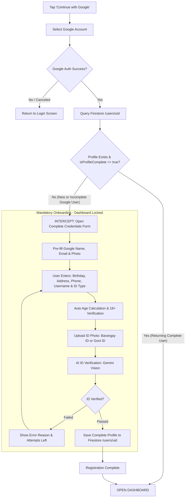
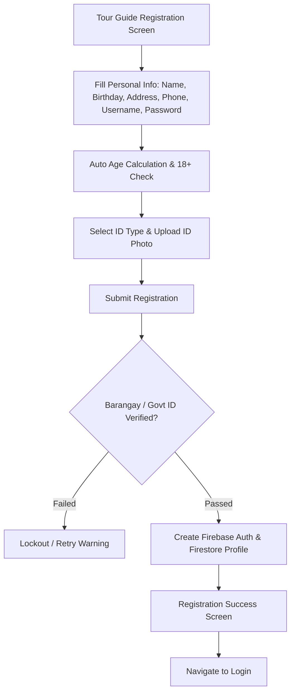

# Tourvia — System Revision 01: Registration and Authentication

> **Revision Code:** `REV-001`  
> **Module:** Tour Guide Registration & Google Authentication Flow  
> **Date Updated:** September 13, 2026  
> **Status:** Specification Approved / Ready for Implementation  
> **Target Platforms:** Android, iOS, Web  

---

## 1. Overview & Objectives

This revision enhances the Tour Guide onboarding experience, modernizes authentication with Google Sign-In, enforces comprehensive identity verification (supporting local IDs like Barangay ID), and ensures complete guide profiling prior to granting system access.

---

## 2. Core Functional Requirements

### 2.1 Birthday / Date of Birth & Automatic Age Calculation
* **Current State:** Manual integer text input for `Age`.
* **Revision Requirements:**
  - Replace the manual `Age` field with an interactive **Birthday / Date of Birth** date picker (`showDatePicker`).
  - Automatically calculate the user's exact age in real time upon date selection:
    $$\text{Age} = \text{Current Year} - \text{Birth Year} \quad (\text{adjusted for month and day})$$
  - Display the calculated age in a read-only field/badge (e.g., `Age: 24 years old`).
  - **Age Restriction Rule:** The user must be **at least 18 years old**. If under 18, prevent submission and display an inline error: *"You must be at least 18 years old to register as a Tour Guide."*
  - Persist both `birthDate` (ISO 8601 string / Timestamp) and `age` (integer) in the Firestore user profile.

---

### 2.2 Mandatory Address
* **Current State:** Address is optional (`Address (Optional)`).
* **Revision Requirements:**
  - Make `Address` a **strictly required field**.
  - Update label to `Complete Address *` with placeholder `e.g. House No., Street, Barangay, City/Municipality, Province`.
  - Validate with `_requiredValidator` to reject empty or whitespace-only inputs.

---

### 2.3 Expanded Valid IDs & Verification (Including Barangay ID)
* **Current State:** AI verification is restricted strictly to DOT Tour Guide IDs with official DOT logos.
* **Revision Requirements:**
  - Expand ID verification to accept recognized Philippine local and national government-issued identification cards:
    1. **Barangay ID / Barangay Clearance with Photo**
    2. **Philippine National ID (PhilID / ePhilID)**
    3. **Driver's License (LTO)**
    4. **Philippine Passport (DFA)**
    5. **UMID / SSS / GSIS ID**
    6. **Postal ID (PhilPost)**
    7. **Voter's ID / Comelec Certificate**
    8. **PRC ID (Professional Regulation Commission)**
    9. **DOT Tour Guide Accreditation ID**
  - **ID Type Selector:** Add a dropdown selector for the user to specify their ID type before or during image upload.
  - **Gemini AI Verification:** Update the AI prompt in `GeminiVisionService` to recognize and validate the authenticity, legibility, completeness, expiration date (if applicable), and match name/details across these supported IDs rather than rejecting for lack of a DOT logo.

---

### 2.4 Continue with Google / Sign in with Google
* **Current State:** Tour Guides can only sign in or register via manual email/username and password.
* **Revision Requirements:**
  - Add a branded **"Continue with Google"** / **"Sign in with Google"** button to both:
    - [TourGuideLoginScreen](file:///c:/flutter_project/TOURVIA/lib/features/auth/screens/tour_guide_login_screen.dart)
    - [TourGuideRegistrationScreen](file:///c:/flutter_project/TOURVIA/lib/features/auth/screens/tour_guide_registration_screen.dart)
  - Seamlessly handle Firebase Google OAuth authentication (`google_sign_in` + `GoogleAuthProvider`).
  - **Strict Principle:** Authenticating via Google is merely the identity step; it **does NOT grant immediate access** to the application.

---

### 2.5 Strict Google Registration Flow & Prevention of Dashboard Access
> [!IMPORTANT]
> **Strict Dashboard Access Prevention Rule:**
> An incomplete Google account is **strictly prevented from entering the Tour Guide Dashboard**. Under no circumstance may an authenticated Google user bypass the credential form or ID verification to access tour features, tracking, or chat.

The Google registration flow must strictly enforce the following linear progression:

$$\mathbf{Google\ Sign\text{-}Up} \longrightarrow \mathbf{Authenticate\ Google\ Account} \longrightarrow \mathbf{Complete\ Credentials} \longrightarrow \mathbf{Verify\ ID} \longrightarrow \mathbf{Save\ Profile} \longrightarrow \mathbf{Dashboard}$$

#### Breakdown of Steps:
1. **Google Sign-Up:** User taps *"Continue with Google"*.
2. **Authenticate Google Account:** User selects their Google account; Google validates credentials and provides `email`, `displayName`, and `photoUrl`.
3. **Complete Credentials (Required Form):**
   - The user is immediately intercepted and routed to the **Complete Profile Form** (`CompleteProfileScreen`).
   - The form pre-fills available data (`Email`, `First Name`, `Last Name`) but **requires** user completion of:
     - First Name (required, editable)
     - Middle Name (optional / if applicable)
     - Last Name (required, editable)
     - Birthday / Date of Birth (date picker, required)
     - Automatically calculated Age (read-only, $\ge 18$ enforced)
     - Contact Number (Philippine +63 format with validation, required)
     - Complete Address (required)
     - Username (required, checked for uniqueness)
     - ID Type (dropdown selector: Barangay ID, National ID, etc., required)
4. **Verify ID:** 
   - User uploads photo of valid ID (Barangay ID, National ID, etc.).
   - Gemini AI verification performs authenticity, legibility, and name matching checks.
   - **Verification Failure:** Profile cannot be saved; user is shown remaining attempts (lockout protection applies).
5. **Save Profile:** 
   - Only after all fields are valid AND the ID is verified, the profile is saved to Firestore `/users/{uid}` with `isProfileComplete: true` and `status: 'approved'`.
6. **Dashboard:** 
   - The Tour Guide Dashboard is unlocked **only after Step 5 is successfully written to Firestore**.

#### Enforcement Mechanisms:
- **Route Guard / Auth Gatekeeper:** 
  If an incomplete Google user attempts to navigate back, reload the app, or close and reopen the application, the app's root authentication listener checks `isProfileComplete`. If incomplete, it forcibly routes the user directly back to the **Complete Credentials / ID Verification screen**.
- **Exit / Cancellation Handling:** 
  If the user refuses to complete credentials and clicks "Cancel" or "Sign Out", the app signs out of Firebase Auth (`FirebaseAuth.instance.signOut()`) and returns them to the Welcome / Login screen. No partial or ghost accounts can access Tourvia.
- **Returning Complete Users:**
  Only users whose Firestore profile already exists with `isProfileComplete == true` skip the onboarding form and navigate directly:  
  $$\text{Continue with Google} \longrightarrow \text{Authenticate Google Account} \longrightarrow \text{Dashboard}$$

---

### 2.6 Philippine Contact Number Validation
* **Current State:** Generic regex with basic error message.
* **Revision Requirements:**
  - Standardize and validate Philippine mobile numbers:
    - Supported Formats:
      - `+639XXXXXXXXX` (13 characters including `+`)
      - `09XXXXXXXXX` (11 digits starting with `09`)
      - `9XXXXXXXXX` (10 digits starting with `9`)
  - Granular validation error messages:
    - **Incomplete / Too Short:** *"Mobile number is too short (11 digits required for 09... or 13 characters for +639...)"*
    - **Excessive / Too Long:** *"Mobile number is too long. Please enter a valid 11-digit mobile number."*
    - **Invalid Characters:** *"Invalid characters. Only digits and a leading '+' are allowed."*
    - **Incorrect Prefix / Format:** *"Mobile number must start with 09 or +639."*
  - Automatically normalize the number to standard E.164 (`+639XXXXXXXXX`) when saving to Firestore for SOS alerts and notifications.

---

## 3. Workflow Diagrams

### 3.1 Strict Google Onboarding & Gatekeeper Flow

### 3.2 Standard Tour Guide Registration Flow

---

## 4. Technical Architecture & File Changes

| Module / Component | Target File | Nature of Change |
| :--- | :--- | :--- |
| **Dependencies** | `pubspec.yaml` | Add `google_sign_in: ^6.2.2` |
| **Auth Service** | [lib/core/services/auth_service.dart](file:///c:/flutter_project/TOURVIA/lib/core/services/auth_service.dart) | Implement `signInWithGoogle()`, `isProfileComplete()`, and `completeGoogleProfile()` |
| **Gemini AI Service** | [lib/core/services/gemini_vision_service.dart](file:///c:/flutter_project/TOURVIA/lib/core/services/gemini_vision_service.dart) | Broaden AI verification prompt to validate Barangay ID and all accepted Philippine government IDs |
| **Validation Utility** | `lib/core/utils/validators.dart` (or `tour_guide_registration_screen.dart`) | Detailed Philippine phone validator (+63 / 09 checks, custom error messages) |
| **Registration UI** | [lib/features/auth/screens/tour_guide_registration_screen.dart](file:///c:/flutter_project/TOURVIA/lib/features/auth/screens/tour_guide_registration_screen.dart) | Birthday picker + auto age calculation, mandatory address, ID type selector, Google Sign-in button |
| **Login UI** | [lib/features/auth/screens/tour_guide_login_screen.dart](file:///c:/flutter_project/TOURVIA/lib/features/auth/screens/tour_guide_login_screen.dart) | Add "Continue with Google" button with profile completeness check |
| **Complete Profile UI** | `lib/features/auth/screens/complete_profile_screen.dart` | **[NEW]** Complete Profile & Credentials form with strict route guard preventing Dashboard access until completion |
| **Strings & Localization** | [lib/core/constants/app_strings.dart](file:///c:/flutter_project/TOURVIA/lib/core/constants/app_strings.dart) | Update labels, ID type options, Google auth text, and detailed phone error strings |

---

## 5. Verification & Acceptance Criteria

1. **Strict Dashboard Access Prevention:**
   - Sign up with Google for the first time -> Verify user is intercepted and placed on `CompleteProfileScreen`.
   - Attempting to press hardware back button or navigate away -> Verify user cannot access Dashboard and is signed out if exiting.
   - Kill and relaunch the app while profile is incomplete -> Verify the app detects incomplete profile and redirects back to `CompleteProfileScreen` instead of Dashboard.
2. **Linear Sequence Enforcement:**
   - Confirm sequence is strictly followed: `Google Sign-Up → Authenticate Google Account → Complete Credentials → Verify ID → Save Profile → Dashboard`.
3. **Birthday & Age Calculation:**
   - Tap Birthday field opens Date Picker with max date set to 18 years prior to today.
   - Selected date automatically computes and updates the displayed Age.
   - Attempting to select < 18 triggers an immediate validation block.
4. **Mandatory Address:**
   - Empty address field triggers inline validation error and prevents form submission.
5. **Barangay ID & Valid IDs:**
   - Selecting "Barangay ID" and uploading a clear Barangay ID image passes AI verification and extracts relevant fields without rejection.
6. **Returning Complete User:**
   - User with an already completed profile (`isProfileComplete == true`) signs in with Google and directly enters the Dashboard without seeing the credentials form.
7. **Philippine Phone Validator:**
   - Test `09123` -> Triggers *"Mobile number is too short"*.
   - Test `0912345678901` -> Triggers *"Mobile number is too long"*.
   - Test `08123456789` -> Triggers *"Mobile number must start with 09 or +639"*.
   - Test `+639123456789` -> Passes validation.
   - Test `09123456789` -> Passes validation.
