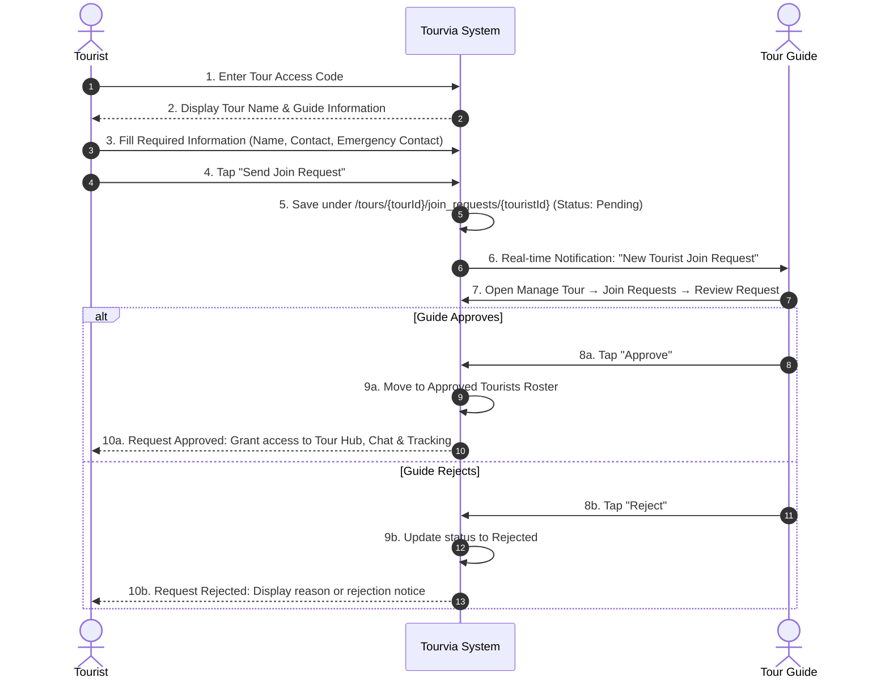

# Tourvia — System Revision 02: Tour Management, Pre-Planning, Itinerary & Scheduling

> **Revision Code:** `REV-002`  
> **Module:** Tour Management, Multi-Tour Pre-Planning, Smart Itinerary, and Tour-Isolated Services  
> **Date Updated:** September 13, 2026  
> **Status:** Specification Approved / Ready for Implementation  
> **Target Platforms:** Android, iOS, Web  

---

## 1. Overview & Objectives

This revision transitions Tourvia from a single-session guide model to a **Multi-Tour Pre-Planning and Management System**. Tour Guides can create, schedule, and prepare multiple tours in advance without conflicts. Each tour operates as an independent container with its own unique access code, tourist join request management (Pending / Approved / Rejected), smart itinerary scheduling, tour-isolated group chat, live tracking, and SOS monitoring.

---

## 2. Updated Main System Architecture

### 2.1 Navigation & Screen Hierarchy
```
Dashboard
   ├── Active Tour Card (or "No Active Tour" Empty State)
   └── Tours (Tour List & Management Screen)
         ├── [Button] Create Tour
         │      ├── Form (Tour Name, Dates, Days, Schedule)
         │      ├── Tour Schedule Conflict Validation (Overlapping Date Check)
         │      └── Auto-Generate Unique Access Code
         │            └── Create Itinerary Screen
         └── Select Tour → Manage Tour Hub
               ├── Tour Information & Access Code (with "Copy Access Code" button)
               ├── Join Requests Management (Pending / Approved / Rejected)
               ├── Itinerary & Scheduling (+ Add Destination)
               ├── Approved Tourists & Attendance
               ├── Group Chat (Tour-Specific, Read-Only when Completed)
               ├── Live Tracking (Tour-Specific)
               └── SOS Monitoring (Tour-Specific)
```

---

## 3. Tour Creation & Pre-Planning Module

### 3.1 Tour Creation Requirements
When the Tour Guide selects **Create Tour**, the form requires:
1. **Tour Name:** e.g. *"Coron Island Expedition"*, *"Baguio Heritage Tour"*.
2. **Start Date:** Date picker (prevent past dates for new tours).
3. **End Date:** Date picker (must be $\ge$ Start Date).
4. **Number of Days:** Automatically computed from Start Date and End Date ($\text{Days} = (\text{End Date} - \text{Start Date}) + 1$), displayed and editable.
5. **Tour Schedule / Description:** Summary of tour schedule, briefing, or general timetable.

### 3.2 Tour Schedule Conflict Validation
> [!IMPORTANT]
> **Conflict Prevention Rule:**
> A Tour Guide can create multiple future tours for pre-planning, but **the system must detect and prevent overlapping tour schedules**.
- When the guide picks the `Start Date` and `End Date` for a new tour (or edits an existing one), the system cross-references all existing tours created by the same guide.
- **Overlap Check Formula:**
  $$\text{NewStartDate} \le \text{ExistingEndDate} \quad \land \quad \text{NewEndDate} \ge \text{ExistingStartDate}$$
- If a conflict is detected:
  - An inline error and modal alert are displayed:  
    *"Schedule Conflict: You already have an existing tour '[Tour Name]' scheduled from [Start Date] to [End Date]. Please adjust the dates so tours do not overlap."*
  - Form submission is blocked until the conflict is resolved.

### 3.3 Automatic Unique Access Code Generation
- **Requirement:** After the tour is saved, the system **automatically generates one unique 6-character alphanumeric Access Code** for that tour (e.g. `TRV-894` or `CRN72X`).
- **No Manual Step:** The Tour Guide is **not** required to navigate to an access log or manually create access codes.
- **Copy Access Code Button:** The generated code is displayed on the tour card and detail page with a clean, single-tap **Copy Access Code** button (with clipboard feedback).
  > **Note:** Do not mention "Share" or include share intent functionality in the application or documentation.
- The Access Code is tied directly to the `tourId`:
  ```
  /tours/{tourId}
  /access_codes/{code} → { tourId: "...", guideId: "...", status: "active" }
  ```

---

## 4. Clear Tour Status Lifecycle

Each tour transitions through three distinct operational states:

$$\mathbf{Upcoming} \longrightarrow \mathbf{Active} \longrightarrow \mathbf{Completed}$$

| Status | Description & Trigger Conditions | Dashboard Behavior |
| :--- | :--- | :--- |
| **`Upcoming`** | Tour is created and scheduled for a future date. Itinerary can be prepared, and tourists can join in advance. | Visible under "Tours" list as upcoming. Does not occupy the Dashboard Active Tour card. |
| **`Active`** | Current date falls within `[startDate, endDate]` AND the tour is started/running. Only **one tour can be active at any given time**. | **Appears prominently on the Dashboard** as the current Active Tour with real-time itinerary tracking. |
| **`Completed`** | Tour reaches its end date or the Tour Guide explicitly taps **"End Tour"**. | Archived. Group chat becomes **Read-Only** (no new messages). Historical records, roster, and attendance are preserved. |

---

## 5. Dashboard "Active Tour" and "No Active Tour" State

### 5.1 "No Active Tour" State
If the Tour Guide currently has no active tour running today:
- The Dashboard displays a clean, dedicated empty state card:
  ```
  ┌─────────────────────────────────────────────────────────┐
  │                   [ Tour Compass Icon ]                 │
  │                      No Active Tour                     │
  │     You currently have no running tour scheduled today. │
  │                                                         │
  │          [ View Scheduled Tours ]   [ + Create Tour ]   │
  └─────────────────────────────────────────────────────────┘
  ```
- **Rule:** Do not show empty, broken, or confusing current tour info. If today is between tours or all tours are upcoming/completed, show **"No Active Tour"**.

### 5.2 Automated Dashboard Current Destination
When an **Active Tour** is running today:
- The Dashboard **Current Destination** card connects dynamically to the active tour's scheduled itinerary:
  - If current time falls inside a destination's `[StartTime, EndTime]` $\rightarrow$ Dashboard displays **Current Destination: [Destination Name]** with an Active badge.
  - If between stops or before the first stop $\rightarrow$ Dashboard displays **Upcoming Destination: [Next Destination Name] starts at [StartTime]**.
  - Destinations automatically shift based on the clock without manual selection.

---

## 6. Tourist Join Request Management

Inside each tour, add a dedicated approval management section:

$$\mathbf{Manage\ Tour} \longrightarrow \mathbf{Join\ Requests} \longrightarrow \mathbf{Pending\ /\ Approved\ /\ Rejected}$$

### 6.1 Join Request Workflow


### 6.2 Membership & Access Enforcement
- **Strict Membership Rule:** **Only approved tourists** become members of that tour.
- Pending or rejected tourists cannot:
  - Access the tour's group chat
  - View live GPS tracking coordinates of the guide or other tourists
  - Have their attendance marked
  - Trigger SOS alerts tied to the tour

---

## 7. Itinerary & Smart Scheduling Rules

### 7.1 Destination Creation & Organization
Path: **Tours → Select Tour → Itinerary → + Add Destination**

Each destination entry contains:
- Destination Name / Location
- Itinerary Date (Date Picker)
- Start Time (Time Picker)
- End Time (Time Picker)
- Day Number (automatically assigned: Day 1, Day 2, etc.)
- Status: Initialized as **`Upcoming`** (never starts as `Done`).
- Notes / Activities description

### 7.2 Strict Scheduling & Validation Rules
| Rule | Description / Logic | Enforcement |
| :--- | :--- | :--- |
| **Time Format** | Use platform time picker for Start Time and End Time. | Native Material TimePicker |
| **Date Range** | Itinerary dates must fall strictly between the tour's `startDate` and `endDate`. | Date Picker constrained by `[tour.startDate, tour.endDate]` |
| **Chronological Order** | End Time cannot be earlier than or equal to Start Time. | Validator: $\text{EndTime} > \text{StartTime}$ |
| **No Backdated Future Tours** | For future tours, destination dates cannot be in the past relative to the tour start. | Date Picker `firstDate: tour.startDate` |
| **No Overlapping Destinations** | A new destination cannot overlap with an existing destination's date and time window within the same tour. | Check: $\text{Start}_A < \text{End}_B \land \text{End}_A > \text{Start}_B$ |
| **Chronological Auto-Sorting** | All destinations are automatically ordered chronologically by Date $\rightarrow$ Start Time. | `itineraryList.sort((a, b) => a.startDateTime.compareTo(b.startDateTime))` |
| **Multi-Day Auto-Grouping** | Multi-day tours are automatically grouped by **Day 1, Day 2, Day 3, etc.** based on the offset from `startDate`. | $\text{DayNumber} = (\text{DestinationDate} - \text{TourStartDate}) + 1$ |
| **Initial Status** | New destinations must start as **`Upcoming`**. | Default enum/string: `'upcoming'` |

---

## 8. Tour-Specific Group Chat & Notifications

### 8.1 Strict Tour-Level Data Isolation
```
/tours/{tourId}/chat/{messageId}
```
- Each tour possesses its own distinct group chat collection.
- **Access Control:** Only the Tour Guide and **approved tourists** belonging to that specific `tourId` can view, listen, or send messages. Messages from one tour will **never** appear in another tour.
- Preserves full support for **text messages and image uploads** (stored under Firebase Storage path `tour_media/{tourId}/chat/...`).

### 8.2 Real-Time Chat Notifications
- Incoming message notifications include:
  - Tour Name
  - Sender Name
  - Message Preview
- Tapping the notification deep-links directly into the **specific tour's group chat**.

### 8.3 Tour Completion & Read-Only Archiving
- When a tour transitions to **`Completed`**:
  - The group chat remains associated with the tour for historical reference.
  - The chat input is disabled and marked **`Read-Only (Tour Ended)`**, preventing any new messages.

---

## 9. Unified Tour Data Structure

Every tour created in Tourvia is an independent entity encapsulated under its own `tourId`:

```
/tours/{tourId}
  ├── Tour Information (name, startDate, endDate, days, schedule, guideId, status: upcoming|active|completed)
  ├── Access Code (generated unique alphanumeric code)
  ├── /join_requests/{touristId} (pending, approved, rejected join requests)
  ├── /itinerary/{stopId} (chronologically sorted destinations with day grouping)
  ├── /tourists/{touristId} (approved roster of tourists joined via access code)
  ├── /attendance/{stopId}/records/{touristId} (per-stop attendance records)
  ├── /chat/{messageId} (tour-isolated group chat messages and media)
  ├── /locations/{userId} (live GPS tracking coordinates for guide & approved tourists)
  └── /sos/{alertId} (urgent emergency alerts tied to this tour)
```

---

## 10. Technical Architecture & File Changes

| Component | Target File | Nature of Change |
| :--- | :--- | :--- |
| **Tour Model** | `lib/core/models/tour_model.dart` | [NEW] Model with `status` (`upcoming`, `active`, `completed`), date ranges, and conflict check helpers |
| **Tour Service** | [lib/core/services/tour_session_service.dart](file:///c:/flutter_project/TOURVIA/lib/core/services/tour_session_service.dart) | Multi-tour CRUD, date conflict validator (`hasScheduleConflict`), auto access code generator, and join request methods |
| **Dashboard Home UI** | [lib/features/tour_guide/screens/tour_guide_home_screen.dart](file:///c:/flutter_project/TOURVIA/lib/features/tour_guide/screens/tour_guide_home_screen.dart) | Add "No Active Tour" empty state, link active tour to scheduled date, and auto destination detection |
| **Tour Pre-Planning UI** | `lib/features/tour_guide/screens/tour_management_screen.dart` | [NEW] Tours list (Upcoming / Active / Completed tabs) and Create Tour form with date conflict validation |
| **Join Requests UI** | `lib/features/tour_guide/screens/tour_join_requests_screen.dart` | [NEW] Join requests screen with Pending / Approved / Rejected tabs and Approve/Reject action buttons |
| **Access Code UI** | Tour detail cards | Display code with "Copy Access Code" button (remove all references to "Share") |
| **Itinerary UI** | [lib/features/tour_guide/screens/tour_guide_itinerary_screen.dart](file:///c:/flutter_project/TOURVIA/lib/features/tour_guide/screens/tour_guide_itinerary_screen.dart) | Add destination rules (time/date pickers, overlap check, Day 1..N grouping, upcoming status) |

---

## 11. Verification & Acceptance Criteria

1. **Join Request Management:**
   - Tourist enters access code and submits join request -> appears in guide's `Manage Tour → Join Requests → Pending` tab.
   - Guide taps "Approve" -> tourist moves to Approved roster and gains access to chat, tracking, and attendance.
   - Guide taps "Reject" -> tourist request is rejected and denied access.
2. **Schedule Conflict Validation:**
   - Create Tour 1 scheduled Oct 1 - Oct 5.
   - Attempt to create Tour 2 scheduled Oct 3 - Oct 7 -> form triggers validation error: *"Schedule Conflict... already scheduled from Oct 1 to Oct 5"*, preventing creation.
   - Attempt to create Tour 3 scheduled Oct 10 - Oct 15 -> succeeds without conflict.
3. **Copy Access Code Only:**
   - Confirm only "Copy Access Code" is present with clipboard copy confirmation; no "Share" button or mention of share exists.
4. **Tour Status & Dashboard Synchronization:**
   - Future tours display as `Upcoming`.
   - On the scheduled tour date, the tour transitions to `Active` and populates the Dashboard Active Tour card.
   - Ending the tour marks it as `Completed` and makes the group chat read-only.
5. **"No Active Tour" State:**
   - When no tour is currently scheduled for today, Dashboard cleanly displays **"No Active Tour"** with action buttons to View Tours or Create Tour.
