# Guide: Creating the Use Case Diagram for TOURVIA

This document serves as a guide for drawing or generating the UML Use Case Diagram for **TOURVIA**. It maps the actors, use cases, and relationships based on the system scope and implementation.

---

## 1. Core Elements of the Diagram

### 1.1 Actors
An actor represents a role played by a user or an external system interacting with the application.

1.  **Tour Guide (Primary Actor - Human):** The user responsible for setting up the session, building the itinerary, monitoring tourists, checking attendance, and ending the tour.
2.  **Tourist (Primary Actor - Human):** The traveler who joins the session using a temporary code, views the itinerary, tracks their position relative to the guide, and uses communication tools.
3.  **Google Gemini Vision API (Secondary Actor - System):** The external multimodal AI service that scans, parses, and validates the Tour Guide's Department of Tourism (DOT) Accreditation ID card.
4.  **Google Gemini Generative AI API (Secondary Actor - System):** The external AI NLP service that acts as the knowledge base for answering travel queries about the Philippines.

---

### 1.2 Use Cases (By Module)

#### User Authentication & Onboarding
*   **UC-01: Register Account (Guide)**
*   **UC-02: Verify Accreditation ID (Gemini)**
*   **UC-03: Log In via Credentials (Guide)**
*   **UC-04: Log In via Access Code (Tourist)**
*   **UC-05: Recover Password (Guide)**
*   **UC-06: Accept Terms & Disclosures (Tourist)**

#### Session & Access Code Control
*   **UC-07: Generate Access Codes (Guide)**
*   **UC-08: Invalidate/Delete Access Codes (Guide)**
*   **UC-09: Reset/Clear Code Slot (Guide)**

#### Itinerary Scheduling
*   **UC-10: Create & Edit Tour Stops (Guide)**
*   **UC-11: Reorder Stops via Drag & Drop (Guide)**
*   **UC-12: View Synced Itinerary Timeline (Tourist & Guide)**
*   **UC-13: View Itinerary Weather Forecast (Tourist & Guide)**

#### Group Management & Safety
*   **UC-14: Monitor Tourist Attendance (Guide)**
*   **UC-15: Track Live Locations on Map (Guide)**
*   **UC-16: Monitor Geofence Safety Boundary (Guide & Tourist)**
*   **UC-17: Remotely Ring Tourist Device (Guide)**
*   **UC-18: Navigate to Tourist Location (Guide)**
*   **UC-19: Navigate back to Guide Location (Tourist)**

#### Emergency & Communication
*   **UC-20: Trigger Emergency SOS Alert (Tourist & Guide)**
*   **UC-21: Resolve Active SOS Alerts (Guide)**
*   **UC-22: Send Messages & Media in Group Chat (Tourist & Guide)**
*   **UC-23: Consult AI Chatbot Assistant (Tourist & Guide)**

#### Session Teardown
*   **UC-24: End Tour Session (Guide)**
*   **UC-25: Edit Profile & Password (Guide)**

---

## 2. Key Use Case Relationships

### 2.1 `<<include>>` Relationships
Used when a use case requires the execution of another use case to complete its flow.
*   **UC-01 (Register Account)** `<<include>>` **UC-02 (Verify Accreditation ID)**: A guide cannot register without the AI successfully verifying their ID.
*   **UC-04 (Log In via Access Code)** `<<include>>` **UC-06 (Accept Terms & Disclosures)**: A tourist cannot complete login without accepting the location disclosure.
*   **UC-24 (End Tour Session)** `<<include>>` **UC-08 (Invalidate/Delete Access Codes)**: Ending a tour automatically invalidates all codes.

### 2.2 `<<extend>>` Relationships
Used when a use case optionally triggers or branches into an additional behavior under specific conditions.
*   **UC-15 (Track Live Locations)** `<<extend>>` **UC-16 (Monitor Geofence Safety Boundary)**: Occurs automatically when the GPS updates.
*   **UC-16 (Monitor Geofence Safety Boundary)** `<<extend>>` **UC-17 (Remotely Ring Tourist Device)**: The guide may choose to ring a tourist if they cross the boundary.
*   **UC-16 (Monitor Geofence Safety Boundary)** `<<extend>>` **UC-19 (Navigate back to Guide)**: Triggered on the tourist's device if they wander out of bounds.
*   **UC-20 (Trigger Emergency SOS Alert)** `<<extend>>` **UC-18 (Navigate to Tourist)**: Tapping an active SOS alert allows the guide to navigate directly to the sender.

---

## 3. Mermaid Use Case Diagram Source Code

You can copy and paste the code below into any Mermaid editor (such as Mermaid Live Editor) to render a visual representation of the Use Case Diagram:

```mermaid
graph TB
    %% Actors
    subgraph Primary_Actors [Human Actors]
        TG((Tour Guide))
        TR((Tourist))
    end
    
    subgraph External_Actors [External Systems]
        Gemini[Google Gemini API]
        GeminiChat[Google Gemini AI API]
    end

    %% System Boundary
    subgraph TOURVIA [TOURVIA Mobile Application System Boundary]
        %% Authentication
        UC1(Register Account)
        UC2(Verify DOT ID Card)
        UC3(Log In via Credentials)
        UC4(Log In via Access Code)
        UC5(Recover Password)
        UC6(Accept GPS Disclosures)
        
        %% Code Management
        UC7(Generate Access Codes)
        UC8(Invalidate Access Code)
        UC9(Clear Code Slot)
        
        %% Itinerary
        UC10(Manage Itinerary Stops)
        UC11(Reorder Stops)
        UC12(View Timeline Itinerary)
        UC13(View Weather Forecast)
        
        %% Tracking & Geofencing
        UC14(Monitor Attendance)
        UC15(Track Live Locations)
        UC16(Monitor Geofence Boundary)
        UC17(Remotely Ring Tourist)
        UC18(Navigate to Tourist)
        UC19(Navigate back to Guide)
        
        %% SOS & Communication
        UC20(Trigger Emergency SOS)
        UC21(Resolve SOS Alert)
        UC22(Group Chat & Media)
        UC23(Consult AI Chatbot)
        
        %% Settings & Teardown
        UC24(End Tour Session)
        UC25(Edit Profile & Security)
    end

    %% Tour Guide Associations
    TG --> UC1
    TG --> UC3
    TG --> UC5
    TG --> UC7
    TG --> UC8
    TG --> UC9
    TG --> UC10
    TG --> UC11
    TG --> UC12
    TG --> UC13
    TG --> UC14
    TG --> UC15
    TG --> UC17
    TG --> UC18
    TG --> UC20
    TG --> UC21
    TG --> UC22
    TG --> UC23
    TG --> UC24
    TG --> UC25

    %% Tourist Associations
    TR --> UC4
    TR --> UC12
    TR --> UC13
    TR --> UC16
    TR --> UC19
    TR --> UC20
    TR --> UC22
    TR --> UC23

    %% External System Associations
    Gemini --> UC2
    GeminiChat --> UC23

    %% Relationships
    UC1 -.->|includes| UC2
    UC4 -.->|includes| UC6
    UC24 -.->|includes| UC8
    
    UC15 -.->|extends| UC16
    UC16 -.->|extends| UC17
    UC16 -.->|extends| UC19
    UC20 -.->|extends| UC18
```

---

## 4. Tips for Drawing the Diagram in Drawing Tools (Lucidchart, Draw.io)

1.  **Layout Setup:**
    *   Draw a large rectangle in the center representing the **TOURVIA System Boundary**.
    *   Place human actors (**Tour Guide** on the left, **Tourist** on the right) outside the boundary.
    *   Place system actors (**Google Gemini Vision API** and **Google Gemini AI API** on the right or bottom) outside the boundary.
2.  **Ovals (Use Cases):**
    *   Represent every action as an oval inside the rectangle. Group them logically (e.g., authentication use cases at the top, emergency/chat at the bottom).
3.  **Connecting Lines:**
    *   Draw solid, unlabeled lines to connect the actors to the use cases they interact with directly.
    *   Draw dashed arrows labeled `<<include>>` pointing *from* the base use case *to* the required use case.
    *   Draw dashed arrows labeled `<<extend>>` pointing *from* the optional extending use case *back to* the base use case.
